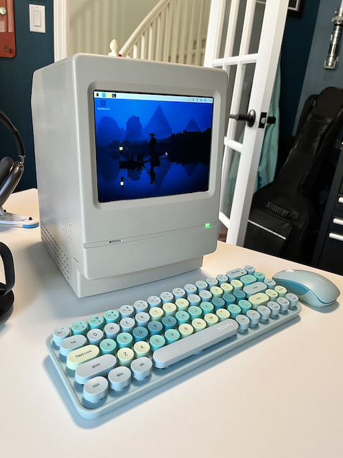

# Classic Macintosh Raspberry Pi 5 PC Build

Over the years, I've adopted many hobbies. I've gone through the retro tech era, the retro gaming era, I've floated in and out of electronics projects, programming projects, MAME, arcade, 3d printing, woodworking, all other maker things, and of course attempting to find the best beer in the world.

While putting together a Raspberry Pi 4 case up on Makerworld to house yet another RPi, I had the idea of making a case for which could emcompass not only the RPi, but also be an all in one design, including a display - all in the spirit of the Classic Apple Macintosh style.

The MacPi project was born.

## Goals

I had the following goals in mind:

**Retro Inspoired Design**

I wanted to retain as much retro inpsiration in the design, and use modern tech only where I needed to or where it was simply practical to do so.

**All in one**

This was obvious.  I wanted a single case, with a single power cable to run it all. I very much liked my Classic Macs I've had and the all in one design appealed to me.

**4:3 LCD Display**

Many projects I've seen conflating retro designs with modern tech included the use of modern wide screen display, and this did fit with my first goal, to be a retro inspired project.

**Raspberry Pi 5 Based**

I wanted to make this PC built on the Raspberry Pi 5.  I don't have any intention to use emulation to mimic the classi cMac OS's. Running native RPi OS's is where I was going with this.

## Case

The case is designed to fit the electronics I used in the project, though I designed it to include as much of the classic mac as I could, including retaining the original main components, the front, the back, the top handle, speaker slots/locations, rear electronics access panel, LED, floppy (SD) slot, etc.

I designed it all in Fusion 360. THe entire thing was printed in four parts. The Front, the back, in two pieces, and the electronics tray.

Here are a few screenshots of the design:

You'll note I tried to retain many of the original aspects of the case, including the coolong fins, the speakers grilles, feet, LED, floppy drive location (now a Micro SD slot). I also attempted to size everything with the LCD display in mind to keep the original proportions.

## Electronics

As I noted the goal was to use a Raspberry Pi 5, and aside from the LCD display, most of the remaining electronics are in support of mounting the Pi inside the case. This includes the power supply, USB extension cables, ethernet extension cable, speakers, amplifier with volumne control, power button, power connector with switch, Micro SD card extension, and of course the Raspberry Pi 5. I also had to include a USB sound card because believe it or not the RPi 5 doesn't have any provisions for outputting sound directly on the board.

I was happy with how the back panel turned out. It houses the power cable and switch, the volume control, a momentary power switch (used to power on and off the RPi via software), the ethernt and two USB connectors.

Here is a shot of the inside with the components mounted.

## 3D Printing The Case

Printing the case was a bit tricky.  While I took many liberties with the design such that I could optimize the print and avoid as much support material requirements as possible, it still need a bit in some key areas. I also split the back into two parts as a five sided case like the back would have needed an incredible amount of support material to print.

I used my Bambu Labs X1 Carbon and the prints came out great.

## Post Processing

Once the case was printed, I spent a fair amoutn of time sanding, priming and painting it. I primed, and wet sanded several times going from 400 through to 1000, and 2000 grit paper. Two coats of paint sprayed on for the final finsh.  I think it turned out great! I really like the colour as well, it very much reminded me of the classi macs.

## Assembly

The case is made up of three parts, the front, the back and the electronics tray.  I designed in provisions for screw in type nut iunserts, like this:

Here is a shot of the nutserts on the back panel.

## What Would I Do Differently Next Time

Overall I am very happy with how this turned out. I achieved all of the goals and it came together rather nicely.  There are a few things however I would do fiferently if I were to do it again.  These are:

**Shell thickness**

  I designed this with a 3mm shell thickness and this is just a little thin for a 3d print for such a large case design.  There is nothing preventing me from goin much thicker, externally would look the same.

**Sound**

The speakers are reasonable for the application, however the amplifier is very poor quality and picks up noise from the RPi.  I should have gone with a better amplifier.

